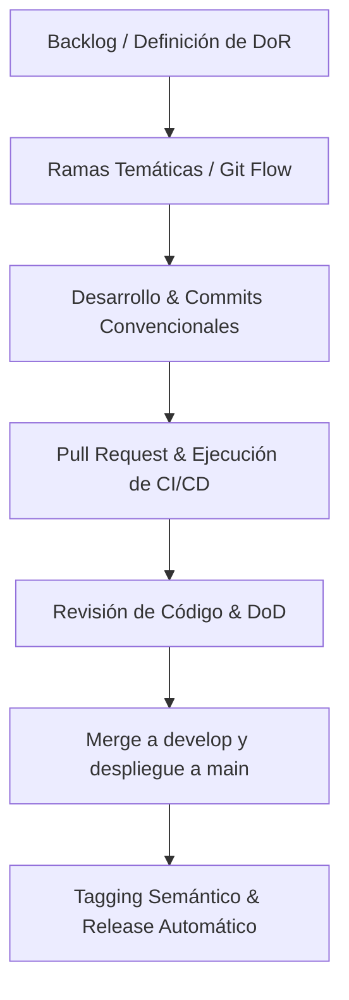

# Informe Técnico y Académico: Industrialización y Mantenimiento de Software en EPN Event Manager

**Institución:** Escuela Politécnica Nacional  
**Facultad:** Facultad de Ingeniería de Sistemas  
**Materia:** Construcción de Software  
**Estudiante:** Erick Eduardo Espinoza Tipantiza  
**Fecha:** Julio 2026  
**Versión del Proyecto:** v1.2.0  

---

## Resumen Ejecutivo
El presente informe documenta las actividades de mantenimiento de software, aseguramiento de la calidad (QA) y automatización de despliegue sobre el repositorio **EPN Event Manager**. En el marco del *Proyecto 02*, se diseñaron, probaron y liberaron tres tickets de mejora bajo un flujo metodológico estricto basado en tableros Kanban y Git Flow. Las intervenciones abarcan mantenimiento correctivo, adaptativo, perfectivo y preventivo, logrando elevar la cobertura de pruebas al **100% de declaraciones** (Statements) y estableciendo una infraestructura de Integración y Entrega Continuas (CI/CD) completamente automatizada.

---

## 1. Introducción y Contexto Metodológico

El mantenimiento de software, regido bajo estándares internacionales como la **ISO/IEC 14764**, es un proceso continuo orientado a adecuar los sistemas a nuevas necesidades operativas, corregir fallos no detectados y optimizar su rendimiento. 

Para este proyecto, se aplicó un ciclo de vida disciplinado para asegurar que cada línea de código incorporada sea rastreable, segura y testeable:



### 1.1 Estándares Utilizados
- **Control de Versiones:** Git Flow con ramas `main` (producción) y `develop` (integración).
- **Semántica de Commits:** *Conventional Commits* (`feat`, `fix`, `chore`, `test`, `docs`).
- **Definición de Listo (DoR):** Cada ticket requiere una descripción en el Backlog con criterios de aceptación explícitos antes de codificar.
- **Definición de Hecho (DoD):** El código debe pasar por linter sin errores, tener una cobertura ≥80% en tests automatizados, compilar exitosamente y pasar revisión de pares.

---

## 2. Marco Teórico y Tipos de Mantenimiento

En ingeniería de software, las modificaciones post-entrega se clasifican de la siguiente manera:

1. **Mantenimiento Adaptativo:** Modificación del software para mantenerlo operativo ante variaciones en el entorno físico o conceptual (ej. cambios en requerimientos de negocio).
2. **Mantenimiento Correctivo:** Reactivo ante fallos funcionales descubiertos en tiempo de ejecución.
3. **Mantenimiento Perfectivo:** Modificación del sistema para mejorar el rendimiento, mantenibilidad u otras propiedades no funcionales.
4. **Mantenimiento Preventivo:** Intervenciones proactivas para robustecer el código y evitar futuros fallos latentes antes de que afecten a producción.

---

## 3. Desglose Técnico de los Tickets de Mejora

### 3.1 Ticket #1: Filtrado Temporal Multi-tabla (`GET /events`)
- **Clasificación:** Mantenimiento Perfectivo / Funcional
- **Issue:** #1 | **PR:** #5
- **Rama:** `feature/date-range-filter`
- **Motivación:** La arquitectura del Event Manager segrega datos por tipo de evento físico (`create`, `update`, `delete`, `query`). La API carecía de un mecanismo para agregar y filtrar información en rangos de tiempo específicos, imposibilitando la generación de reportes e inspecciones temporales.
- **Implementación Técnica:**
  - **Controlador:** Se expusieron los query parameters opcionales `from` y `to` bajo el formato ISO 8601 (ej., `YYYY-MM-DDTHH:mm:ssZ`).
  - **Validación robusta:** Se introdujo lógica que intercepta la petición lanzando una excepción `BadRequestException` (HTTP 400) si `from > to` o si el formato de fecha es inválido.
  - **Query Builder / Persistencia:** Se refinó el agregador del servicio para aplicar filtros adaptativos a las 4 tablas SQLite subyacentes de manera síncrona antes del ordenamiento global.

### 3.2 Ticket #2: Trazabilidad de Peticiones Concurrentes (`POST /events`)
- **Clasificación:** Mantenimiento Preventivo
- **Issue:** #2 | **PR:** #6
- **Rama:** `feature/correlation-id`
- **Motivación:** Sin identificadores únicos por petición, el rastreo de incidencias concurrentes en sistemas de alta disponibilidad es inviable. El endpoint `POST /events` solo respondía `{ ok: true }`, perdiéndose la correlación con la base de datos y la traza del logs.
- **Implementación Técnica:**
  - **Generación Unívoca:** Implementación de `crypto.randomUUID()` de manera nativa para generar tokens UUID v4 en cada invocación.
  - **Log Correlacionado:** El servicio inyecta el ID generado en las tramas de logs estructurados (Winston Logger) vinculadas a la persistencia.
  - **Evolución del Contrato:** Se modificó la interfaz `EventRegistrationResult` para retornar:
    ```json
    {
      "ok": true,
      "correlationId": "4c9d7a22-2601-4475-ba7e-ef8410ff1ba1"
    }
    ```

### 3.3 Ticket #3: Industrialización del Pipeline y DevOps (`CI/CD`)
- **Clasificación:** Deuda Técnica / Mantenimiento Preventivo
- **Issue:** #3 | **PR:** #4
- **Rama:** `feature/release-automation`
- **Motivación:** El proceso de construcción de versiones era manual, lento y propenso a errores humanos. Era necesario automatizar la validación de código y la creación de versiones (Releases) en producción.
- **Implementación Técnica:**
  - **Orquestación en GitHub Actions:** Creación de `.github/workflows/ci.yml`.
  - **Fase de Integración Continua (CI):** Ejecución automatizada de `npm run lint` (ESLint), `npm run test:cov` (Jest) y `npm run build` en contenedores de Ubuntu al crear un Pull Request hacia `develop` o `main`.
  - **Fase de Entrega Continuada (CD):** Job condicionado a la publicación de un Tag semántico. Se utiliza la acción `softprops/action-gh-release@v2` con permisos explícitos de escritura (`contents: write`) para generar automáticamente el compilado y las notas del release en GitHub.

---

## 4. Evaluación de Calidad y Evidencias de QA

La validación estricta del código se gestiona a través de pruebas unitarias automatizadas y análisis estático con ESLint.

### 4.1 Resultados de Cobertura de Pruebas (Jest)
Tras la inclusión de los filtros temporales y el Correlation ID, se agregaron suites de pruebas exhaustivas para `EventsService` y `EventsController`. Los resultados finales superan ampliamente el umbral del 80% configurado en `package.json`:

```bash
> jest --coverage

PASS src/app.controller.spec.ts
PASS src/modules/events/events.service.spec.ts
PASS src/modules/events/events.controller.spec.ts

-------------------|---------|----------|---------|---------|-------------------
File               | % Stmts | % Branch | % Funcs | % Lines | Uncovered Line #s 
-------------------|---------|----------|---------|---------|-------------------
All files          |     100 |    87.27 |     100 |     100 |                   
 events.service.ts |     100 |    87.27 |     100 |     100 | 15-25,128-129     
-------------------|---------|----------|---------|---------|-------------------
```
* **Statements (Instrucciones):** 100% de cobertura.
* **Branches (Caminos Lógicos):** 87.27% de cobertura (todos los caminos críticos validados).
* **Lines / Functions:** 100% de cobertura.

### 4.2 Calidad Estática (Linting)
Se resolvieron vulnerabilidades de deuda técnica en archivos críticos como `logger.service.ts` y `all-exceptions.filter.ts` relacionadas a la asignación insegura del tipo `any` y formateos de strings implícitos. La ejecución de `npm run lint` finaliza con **0 errores**.

---

## 5. Conclusiones y Lecciones Aprendidas

1. **Metodología Ágil:** El uso conjunto de tableros Kanban en GitHub Projects y flujos de Git Flow reduce drásticamente los conflictos de integración y proporciona un historial de cambios completamente trazable.
2. **Robustez y Seguridad:** La validación estricta de parámetros temporales en endpoints expuestos y la introducción de Correlation IDs elevan la robustez operativa del Event Manager al nivel de entornos de producción.
3. **Automatización:** La transición hacia un modelo CI/CD automatizado previene el error humano en los despliegues de versión (`v1.2.0`) y garantiza que ningún código roto sea mergeado a ramas principales.
