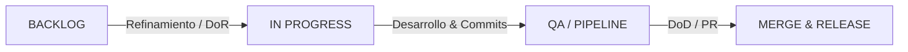

# Guía de Contribución y Ciclo de Vida de los Tickets

Cada mejora o nueva característica en este proyecto debe atravesar estrictamente el siguiente ciclo de vida. Este proceso asegura la calidad, trazabilidad y correcta integración de los cambios.

## Flujo del Ciclo de Vida del Ticket



### 1. Planificación y Diseño (El Kanban)
- **Creación y Refinamiento:** Todo ticket debe nacer en el Backlog del tablero Kanban del equipo (GitHub Projects). Debe estar tipificado como Feature, Bug o Technical Debt.
- **Definition of Ready (DoR):** Antes de pasar a *In Progress*, el ticket debe tener:
  - Descripción detallada y motivación.
  - Criterios de Aceptación claros.
  - Responsable asignado (Assignment individual).
  - Estimación inicial (opcional pero recomendada).

### 2. Implementación (Git Flow y Commits)
- **Ramas:** Crea una rama nueva a partir de `develop` para tu trabajo:
  ```bash
  git checkout develop
  git pull origin develop
  git checkout -b feature/nombre-del-ticket
  ```
- **Convenciones de Commits:** Todos los commits deben seguir las convenciones de Conventional Commits (ej. `feat(events): add date filter`, `fix(api): resolve memory leak`).
- **Commits Atómicos:** Realiza commits pequeños y enfocados, vinculados al número de ticket (ej. `Closes #42`).

### 3. QA y Pipeline (CI/CD Automático)
Al abrir un Pull Request hacia `develop` o `main`, se disparará automáticamente el pipeline de GitHub Actions (`ci.yml`), el cual validará:
- **Linting:** `npm run lint` (Código limpio y sin warnings críticos).
- **Testing:** `npm run test:cov` (Pruebas unitarias exitosas).
- **Cobertura:** El threshold global de cobertura de código (Statements, Lines, Functions) debe ser igual o superior al **80%**.
- **Build:** `npm run build` compila el proyecto de NestJS correctamente.

### 4. Definition of Done (DoD) y Code Review (El PR)
Un ticket se considera finalizado cuando cumple su **Definition of Done (DoD)**:
- Todo el código compila y la aplicación levanta sin errores.
- Los Criterios de Aceptación están 100% probados.
- Existen pruebas unitarias/integración y la cobertura en el CI se mantiene >= 80%.
- El Pull Request fue aprobado (Approve) por al menos otro miembro del equipo.
- No hay deuda técnica severa ni vulnerabilidades introducidas.

### 5. Merge y Release Automation
- **Merge:** Una vez el PR tenga luz verde en el Pipeline y los reviews aprobados, se debe realizar el **Squash and Merge** hacia `develop`.
- **Release Automation:** 
  Para generar una nueva versión (Release) en producción (`main`), sigue estos pasos:
  1. Crea un Pull Request de `develop` hacia `main` y fúndelo.
  2. Crea y empuja un Tag de versión (ej. `v1.2.0`) desde la rama `main`:
     ```bash
     git checkout main
     git pull origin main
     git tag v1.2.0
     git push origin v1.2.0
     ```
  3. Esto disparará el Job de **Release** en las GitHub Actions, el cual publicará automáticamente un **GitHub Release** con las release notes generadas según los Pull Requests integrados.
